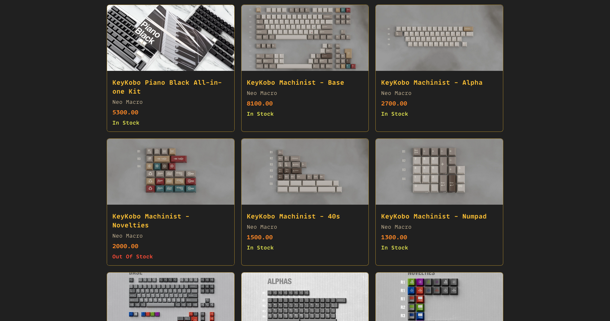

# Shopify Scraper

## Description

This is a simple scraper that uses the public `products.json` endpoint of a Shopify store to scrape all products and their variants. The scraper is written entirely in Go.
The JSON files are parsed and displayed using `html/template` and `net/http` server.



## Structure

- `main.go` - The main entry point of the application.
- `sites.csv` - The CSV file containing the Shopify store URLs. The server uses this to scrape the sites.
- `scraper.go` - The scraper logic.
- `views/` - Contains the HTML templates for the server.
- `static/` - Contains the CSS files for the server.
- `json/` - This directory is created when the server is run. It contains the JSON files of the scraped sites.

## Usage

- Clone the repository

```sh
git clone https://github.com/ChrolloKryber/shopify-scraper.git
```

- Run the server

```sh
go run .
```

- Run the server via Docker compose

```sh
docker compose up --build
```

- Run the server via Docker

```sh
docker build -t shopify-scraper . &&
docker run -p 8080:8080 --name shopify-scraper -itd shopify-scraper
```

Running the server exposes API endpoints at `/api/refresh` and `/api/products`. The server serves the HTML templates at `/` at port `8080`.

### Running the server

**`/api/refresh` Must be run <u>at least once</u> before accessing the site at `/`.**

- `/api/refresh` - Scrapes the sites in `sites.csv` and saves the JSON files in the `json/` directory.
- `/api/products` - Displays the products and their variants in a JSON format.
- `/` - Displays the products scraped.

## Adding Sites

- Add the store name and domain to the `sites.csv` file
- The store name is used as the filename for the JSON file
- Re-run the server by hitting the `/api/refresh` endpoint
- The server will scrape the new site and save the JSON file in the `json/` directory

## Limitations

- The scraper only scrapes the first 250 products of a store
- This is due to the Shopify API limitation
- If run via Docker, the JSON files will have `root` as the owner

## Dependencies

- No external dependencies are required to run the server
- However, [Prettier](https://prettier.io/) is used to format the JSON files
  - Install Prettier globally
  - Running the server via docker will automatically format the JSON files
- The server uses the standard library for all its operations-
